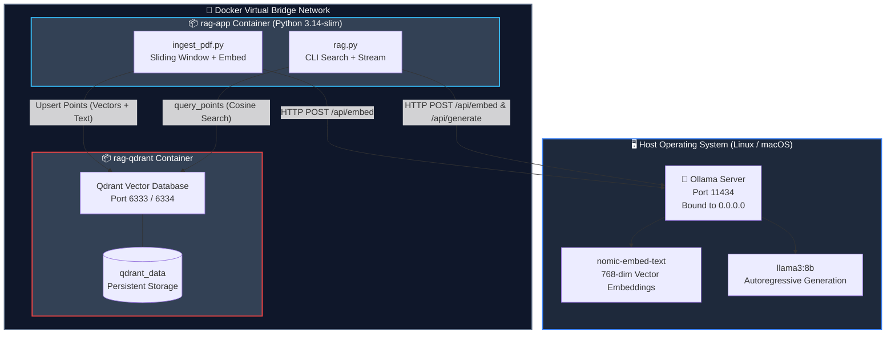
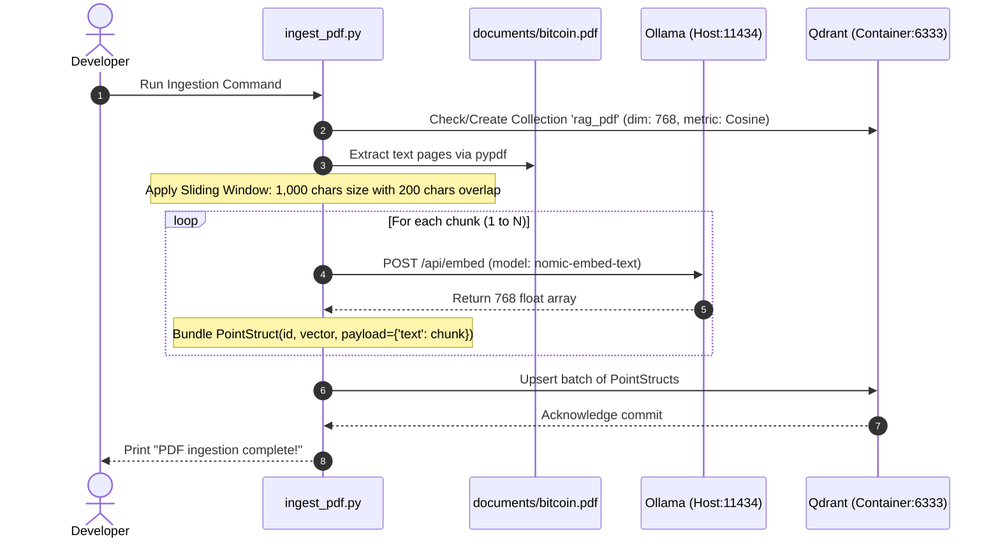
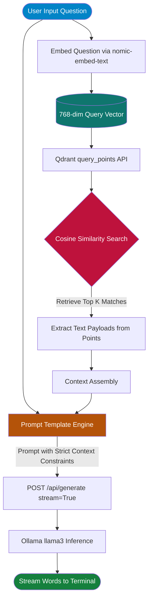

# Local RAG from Scratch 🧠⚡

A fully containerized, local **Retrieval-Augmented Generation (RAG)** system built completely from scratch using **Python**, **Docker**, **Qdrant**, and **Ollama**.

This repository intentionally avoids black-box frameworks such as LangChain, LlamaIndex, or Haystack. Every step—from sliding-window chunking and vector database ingestion to strict prompt templating and streaming token generation—is implemented directly with standard HTTP requests and official SDKs.

---

## 📑 Table of Contents

- [Overview & Key Features](#-overview--key-features)
- [System Architecture](#-system-architecture)
- [Detailed Pipeline & Code Flow](#-detailed-pipeline--code-flow)
- [Directory Structure](#-directory-structure)
- [Source Code Reference](#-source-code-reference)
  - [Infrastructure: `docker-compose.yml`](#1-infrastructure-docker-composeyml)
  - [Environment: `app/Dockerfile` & `requirements.txt`](#2-environment-appdockerfile--requirementstxt)
  - [Ingestion: `app/ingest_pdf.py`](#3-ingestion-appingest_pdfpy)
  - [Interactive RAG Interface: `app/rag.py`](#4-interactive-rag-interface-appragpy)
- [Setup & Installation Guide](#-setup--installation-guide)
- [Engineering Decisions & Troubleshooting](#-engineering-decisions--troubleshooting)
- [RAG Flow Summary](#-rag-flow-summary)
- [Key Technologies](#-key-technologies)
- [Project Goal](#-project-goal)

---

## 🌟 Overview & Key Features

- **100% Local & Private:** No external API keys such as OpenAI, Anthropic, or Pinecone are required.
- **Pure Python Logic:** Direct API calls to Ollama endpoints (`/api/embed` and `/api/generate`) provide transparency into the RAG pipeline.
- **Sliding-Window Chunking:** Text is split into 1,000-character segments with a 200-character overlap to help preserve context across boundaries.
- **Vector Search Engine:** Qdrant performs cosine similarity search in a 768-dimensional vector space.
- **Strict Grounding:** The system prompt instructs the LLM to answer only from the retrieved document context.
- **Terminal Streaming:** Responses are streamed in real time using `stream=True`.

---

## 🏗️ System Architecture

The architecture bridges the host machine, which runs Ollama and the local models, with isolated Docker containers for the Python application and Qdrant.



### Components & Responsibilities

| Component | Execution Context | Port / Endpoint | Responsibility |
| --- | --- | --- | --- |
| **Ollama** | Host System | `11434` | Runs local AI models using local GPU/CPU resources. |
| **`nomic-embed-text`** | Inside Ollama | `/api/embed` | Maps text into 768-dimensional vector representations. |
| **`llama3`** | Inside Ollama | `/api/generate` | Generates final responses using the assembled context. |
| **Qdrant** | Docker Container | `6333` | Stores vectors and performs cosine similarity searches. |
| **Python App** | Docker Container | Internal CLI | Orchestrates document extraction, embedding, retrieval, and user interaction. |

---

## ⚙️ Detailed Pipeline & Code Flow

### 1. Ingestion Phase (`ingest_pdf.py`)



### 2. Retrieval & Generation Phase (`rag.py`)



---

## 📁 Directory Structure

```text
rag-learning/
├── docker-compose.yml          # Container configuration and networking bridge
├── documents/
│   └── bitcoin.pdf             # Source document for ingestion
└── app/
    ├── Dockerfile              # Container definition for the Python environment
    ├── requirements.txt        # Python package dependencies
    ├── embedding_test.py       # Verifies Ollama connectivity and cosine calculations
    ├── ingest_pdf.py           # PDF reader, sliding-window chunker, Qdrant uploader
    └── rag.py                  # Interactive terminal chat with streaming generation
```

---

## 💻 Source Code Reference

### 1. Infrastructure: `docker-compose.yml`

```yaml
services:
  rag-app:
    build: ./app
    container_name: rag-app
    volumes:
      - ./app:/app
      - ./documents:/documents
    environment:
      OLLAMA_HOST: host.docker.internal
    extra_hosts:
      - "host.docker.internal:host-gateway"
    command: python embedding_test.py

  qdrant:
    image: qdrant/qdrant:latest
    container_name: rag-qdrant
    ports:
      - "6333:6333"
      - "6334:6334"
    volumes:
      - qdrant_data:/qdrant/storage
    restart: unless-stopped

volumes:
  qdrant_data:
```

### 2. Environment: `app/Dockerfile` & `requirements.txt`

#### `app/requirements.txt`

```text
requests
qdrant-client
pypdf
```

#### `app/Dockerfile`

```dockerfile
FROM python:3.14-slim

WORKDIR /app

COPY requirements.txt .

RUN pip install --no-cache-dir -r requirements.txt

COPY . .

CMD ["python", "embedding_test.py"]
```

### 3. Ingestion: `app/ingest_pdf.py`

```python
import uuid
import requests
from qdrant_client import QdrantClient
from qdrant_client.models import Distance, VectorParams, PointStruct
from pypdf import PdfReader

OLLAMA_URL = "http://host.docker.internal:11434/api/embed"
MODEL = "nomic-embed-text"
COLLECTION_NAME = "rag_pdf"


def embed(text):
    response = requests.post(
        OLLAMA_URL,
        json={"model": MODEL, "input": text}
    )

    response.raise_for_status()
    return response.json()["embeddings"][0]


def get_chunks(text, chunk_size=1000, overlap=200):
    chunks = []
    start = 0

    while start < len(text):
        end = start + chunk_size
        chunks.append(text[start:end])
        start += chunk_size - overlap

    return chunks


qdrant = QdrantClient(
    host="qdrant",
    port=6333
)

if not qdrant.collection_exists(COLLECTION_NAME):
    qdrant.create_collection(
        collection_name=COLLECTION_NAME,
        vectors_config=VectorParams(
            size=768,
            distance=Distance.COSINE
        )
    )


print("Extracting text from PDF...")

reader = PdfReader("/documents/bitcoin.pdf")
raw_text = ""

for page in reader.pages:
    raw_text += page.extract_text() + " "

raw_text = " ".join(raw_text.split())


print("Chunking text using sliding window...")

chunks = get_chunks(
    raw_text,
    chunk_size=1000,
    overlap=200
)

print(f"Created {len(chunks)} overlapping chunks.")


points = []

for idx, chunk in enumerate(chunks):
    print(f"Embedding chunk {idx + 1}/{len(chunks)}...")

    points.append(
        PointStruct(
            id=str(uuid.uuid4()),
            vector=embed(chunk),
            payload={
                "text": chunk,
                "source": "bitcoin.pdf"
            }
        )
    )


print("Uploading to Qdrant...")

qdrant.upsert(
    collection_name=COLLECTION_NAME,
    points=points
)

print("PDF ingestion complete!")
```

### 4. Interactive RAG Interface: `app/rag.py`

```python
import json
import requests
from qdrant_client import QdrantClient

OLLAMA_EMBED_URL = "http://host.docker.internal:11434/api/embed"
OLLAMA_CHAT_URL = "http://host.docker.internal:11434/api/generate"

EMBED_MODEL = "nomic-embed-text"
CHAT_MODEL = "llama3"
COLLECTION_NAME = "rag_pdf"


def embed(text):
    response = requests.post(
        OLLAMA_EMBED_URL,
        json={
            "model": EMBED_MODEL,
            "input": text
        }
    )

    response.raise_for_status()
    return response.json()["embeddings"][0]


def generate_stream(prompt):
    response = requests.post(
        OLLAMA_CHAT_URL,
        json={
            "model": CHAT_MODEL,
            "prompt": prompt,
            "stream": True
        },
        stream=True
    )

    response.raise_for_status()

    for line in response.iter_lines():
        if line:
            chunk = json.loads(line)

            if "response" in chunk:
                print(
                    chunk["response"],
                    end="",
                    flush=True
                )

    print()


print("Connecting to Qdrant database...")

qdrant = QdrantClient(
    host="qdrant",
    port=6333
)


print("\n" + "=" * 50)
print("Bitcoin Whitepaper RAG Initialized.")
print("Type 'exit' or 'quit' to terminate.")
print("=" * 50 + "\n")


while True:
    try:
        question = input("\nYou: ")

        if question.lower() in ["quit", "exit"]:
            print("Goodbye!")
            break

        if not question.strip():
            continue

        # 1. Embed & Retrieve
        query_vector = embed(question)

        search_results = qdrant.query_points(
            collection_name=COLLECTION_NAME,
            query=query_vector,
            limit=3
        )

        # 2. Context Injection
        context = "\n\n".join(
            [
                result.payload["text"]
                for result in search_results.points
            ]
        )

        # 3. Grounded Prompt Formulation
        final_prompt = f"""You are a helpful assistant. Answer the user's question based ONLY on the provided context. If the context doesn't contain the answer, say "I don't know based on my current knowledge."

Context:
{context}

Question:
{question}

Answer:"""

        # 4. Stream Tokens
        print("Assistant: ", end="", flush=True)
        generate_stream(final_prompt)

    except KeyboardInterrupt:
        print("\nSession interrupted. Exiting.")
        break
```

---

## 🚀 Setup & Installation Guide

### Prerequisites

- Docker installed
- Docker Compose installed
- Ollama installed on the host system

### Step 1: Configure Ollama for Docker Access

By default, Ollama only listens on `127.0.0.1`, which prevents access from Docker containers through `host.docker.internal`.

On Linux with systemd:

```bash
sudo systemctl edit ollama.service
```

Insert:

```ini
[Service]
Environment="OLLAMA_HOST=0.0.0.0"
```

Reload and restart Ollama:

```bash
sudo systemctl daemon-reload
sudo systemctl restart ollama
```

### Step 2: Pull Local Models

Download the embedding model and generative model on the host:

```bash
ollama pull nomic-embed-text
ollama pull llama3
```

### Step 3: Start Qdrant & Ingest Data

#### 1. Launch Qdrant

```bash
docker compose up -d qdrant
```

#### 2. Download the source document

```bash
mkdir -p documents
curl -o documents/bitcoin.pdf https://bitcoin.org/bitcoin.pdf
```

#### 3. Build the application container

```bash
docker compose build rag-app
```

#### 4. Run PDF ingestion

```bash
docker compose run --rm rag-app python ingest_pdf.py
```

### Step 4: Launch the Streaming Chat

Run the interactive chat loop:

```bash
docker compose run --rm -it rag-app python rag.py
```

You can then ask questions about the ingested Bitcoin whitepaper directly from the terminal.

---

## 🛠️ Engineering Decisions & Troubleshooting

### 1. `Connection refused (Errno 111)` via `host.docker.internal`

**Cause:** Ollama was bound only to the loopback interface `127.0.0.1`.

**Solution:** Configure:

```ini
Environment="OLLAMA_HOST=0.0.0.0"
```

and map the Docker host gateway:

```yaml
extra_hosts:
  - "host.docker.internal:host-gateway"
```

---

### 2. Python PEP 668: `externally-managed-environment`

**Cause:** Debian/Ubuntu systems can prevent global Python package installation through standard `pip install`.

**Solution:** Package the application inside an isolated Docker container rather than bypassing OS protections with:

```bash
--break-system-packages
```

---

### 3. Qdrant API Migration

**Error:**

```text
AttributeError: 'QdrantClient' object has no attribute 'search'
```

**Cause:** The Qdrant client removed the legacy `.search()` method.

**Solution:** Use the modern unified query API:

```python
response = qdrant.query_points(
    collection_name=COLLECTION_NAME,
    query=query_vector,
    limit=3
)
```

---

### 4. Sliding Window Overlap vs. Fixed-Character Splitting

**Problem:** Splitting text strictly every 1,000 characters can cut words and sentences in half, causing context loss.

**Solution:** Use a step size of:

```text
chunk_size - overlap = 1000 - 200 = 800
```

Therefore, 200 characters from the end of each chunk overlap with the beginning of the next chunk.

---

## 🔄 RAG Flow Summary

```text
PDF Document
     │
     ▼
Extract Text with pypdf
     │
     ▼
Sliding Window Chunking
(1000 chars / 200 overlap)
     │
     ▼
Ollama: nomic-embed-text
     │
     ▼
768-Dimensional Embeddings
     │
     ▼
Qdrant Vector Database
     │
     │
     │  User Question
     │       │
     │       ▼
     │  Embed Question
     │       │
     │       ▼
     └──► Cosine Similarity Search
             │
             ▼
        Top 3 Chunks
             │
             ▼
       Context + Question
             │
             ▼
        Ollama: llama3
             │
             ▼
       Streaming Answer
```

---

## 📌 Key Technologies

| Technology | Purpose |
| --- | --- |
| **Python** | Application orchestration |
| **Docker / Docker Compose** | Containerization |
| **Ollama** | Local embedding and LLM inference |
| **nomic-embed-text** | Text embeddings |
| **llama3** | Local generative model |
| **Qdrant** | Vector database and similarity search |
| **pypdf** | PDF text extraction |

---

## 🎯 Project Goal

This project demonstrates the core building blocks of a local RAG system:

1. Extract information from documents.
2. Split documents into overlapping chunks.
3. Convert chunks into vector embeddings.
4. Store embeddings in a vector database.
5. Embed user questions.
6. Retrieve the most relevant document chunks.
7. Inject retrieved context into an LLM prompt.
8. Generate a grounded response using a local LLM.

---

## 🔒 Privacy

The project is designed around local execution. The document, embeddings, retrieval process, and LLM inference are intended to remain on the local machine rather than relying on external AI APIs.

---

## ⭐ Learning Focus

This project is especially useful for understanding what happens **under the hood of a RAG system** without hiding the important pieces behind a high-level framework.

The main concepts covered are:

- Document ingestion
- PDF text extraction
- Text chunking
- Overlapping windows
- Embeddings
- Vector databases
- Cosine similarity
- Semantic retrieval
- Context injection
- Prompt grounding
- Local LLM inference
- Streaming generation
- Docker networking
- Host-to-container communication